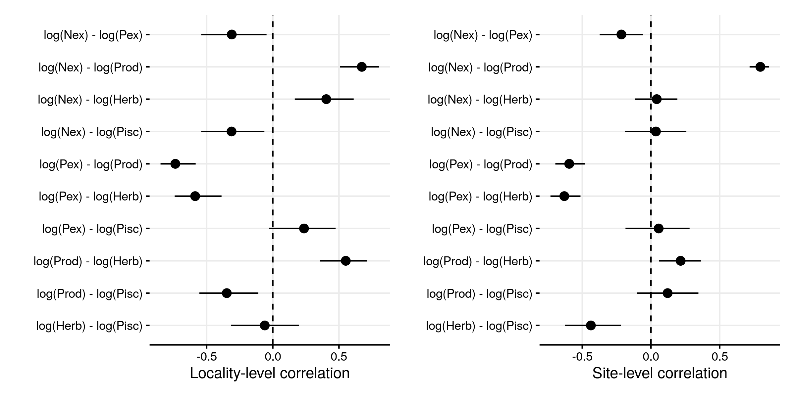
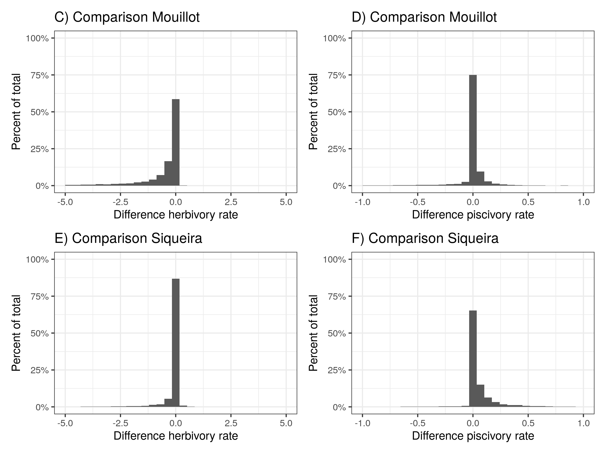

---
output:
  word_document:
    fig_caption: yes
    reference_docx: ../text/word_template.docx
bibliography: ../text/global_proc.bib
csl: nature.csl
---

```{r setup, include=FALSE}
knitr::opts_chunk$set(echo = FALSE, message = FALSE, error = FALSE)
library(tidyverse)
library(flextable)
library(officer)
library(drake)
library(broom)

# loadd(SI_fig1)
# loadd(SI_fig2)
# loadd(SI_pp_plots)
# loadd(SI_rank_plots)
```

# Supplementary data figures and tables: Drivers and vulnerability of global coral reef fish functions

## Tables

```{r, echo = FALSE}
data <- drake::readd(summary_transect_complete) %>%
  group_by(bioregion, locality) %>%
  summarize(n_sites = length(unique(sites)),
            n_transects = n()) 

  flextable(data) %>%
    fontsize(size = 8) %>%
    fontsize(size = 10, part = "header") %>%
    set_caption("Extended Date table 1: Overview of localities of UVC transects, used in this study, including number of sites and number of transects") %>%
    autofit()
```

```{r, echo = FALSE}
 table <- readd(tab_mod_mv_siteloc)
  flextable(table) %>%
    fontsize(size = 8) %>%
    fontsize(size = 10, part = "header") %>%
    merge_v(j = 1) %>% 
    border_inner_h(border = fp_border(color = "black", style = "solid", width = 1)) %>%
    set_caption("Supplementary table 2: Overview of parameters of the multivariate regression predicting the five functions with intercepts only.") %>%
    autofit()
```

```{r, echo = FALSE}
 table <- readd(tab_mod_mvfun_bm)
  flextable(table) %>%
    fontsize(size = 8) %>%
    fontsize(size = 10, part = "header") %>%
    merge_v(j = 1) %>% 
    border_inner_h(border = fp_border(color = "black", style = "solid", width = 1)) %>%
    set_caption("Supplementary table 3: Overview of parameters of the multivariate regression predicting the five functions with biomass and sst.") %>%
    autofit()
```

```{r, echo = FALSE}
 table <- readd(tab_mod_mvfun_com)
  flextable(table) %>%
    fontsize(size = 8) %>%
    fontsize(size = 10, part = "header") %>%
    merge_v(j = 1) %>% 
    border_inner_h(border = fp_border(color = "black", style = "solid", width = 1)) %>%
    set_caption("Supplementary table 4: Overview of parameters of the multivariate regression predicting the five functions and community variables.") %>%
    autofit()
```

  

## Figures







